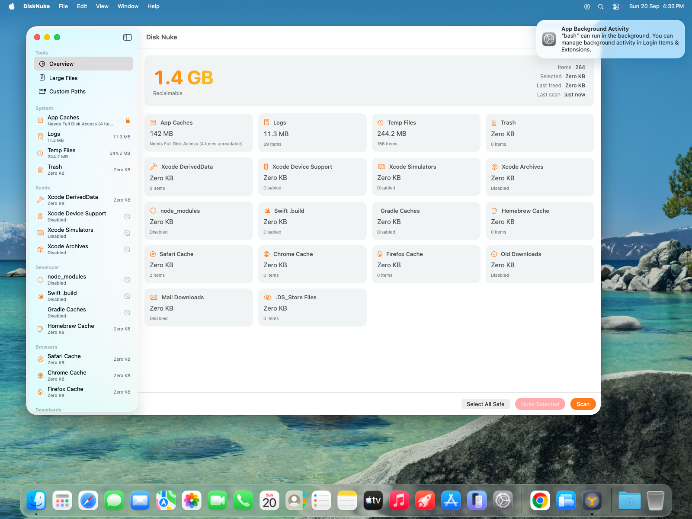
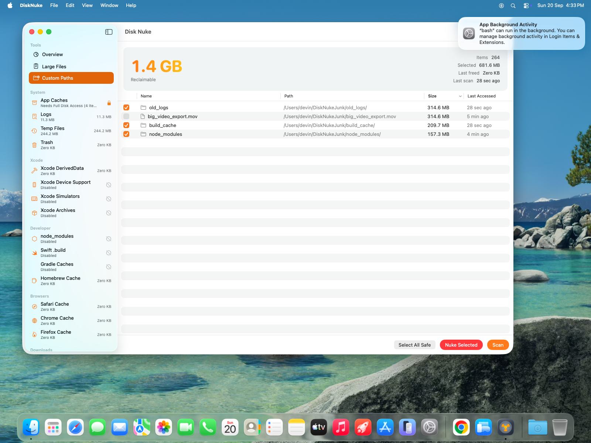
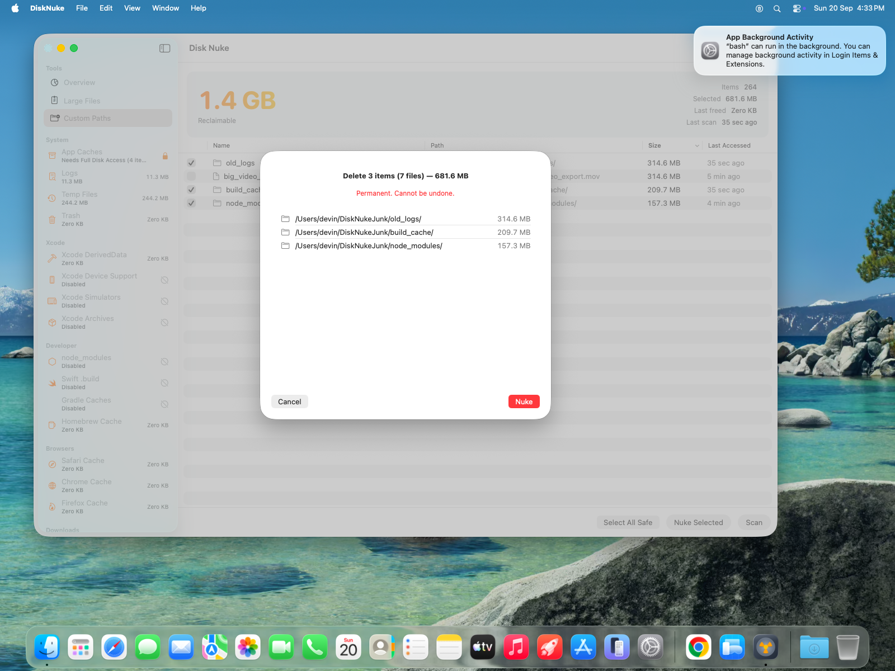
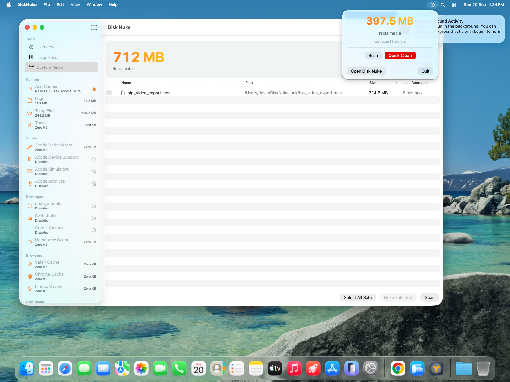

# Disk Nuke

A native macOS disk cleaner that finds reclaimable space — caches, logs, build artifacts, old downloads — and deletes it safely.

## Features

- **Categorized scanner** — 18 categories (app caches, logs, temp files, Trash, Xcode DerivedData/Device Support/Simulators/Archives, node_modules, Swift `.build`, Gradle, Homebrew cache, Safari/Chrome/Firefox caches, old Downloads, Mail downloads, .DS_Store) scanned concurrently with live per-category progress and per-category enable toggles
- **Large Files finder** — walks your home folder and surfaces the biggest files above a configurable threshold, sorted by size and last access
- **Dry-run preview + confirmation** — itemized confirmation sheet shows item count, recursive file count, and total bytes before anything is deleted; deletion is permanent and itemized failures are reported
- **Safety guardrails** — hardcoded denylist (Documents, Desktop, Pictures, system paths, `.app` bundles, scan roots themselves), user-defined exclusions, and in-use/inaccessible files are skipped and reported rather than failing the run
- **Customization** — min size/age thresholds, downloads age, large-file threshold, custom scan paths (whole folder / contents / older-than-N-days), all persisted via UserDefaults; `-extraScanRoot /path` launch argument or `DISK_NUKE_EXTRA_ROOT` env var seeds a test path
- **Main window + menu bar quick-clean** — menu bar popover shows reclaimable space and can quick-clean safe categories without opening the app

## Screenshots






## Requirements

- macOS 14.0+
- Xcode 16+ (developed with Xcode 26)

## Build

```sh
xcodebuild -project DiskNuke.xcodeproj -scheme DiskNuke -configuration Debug -derivedDataPath build clean build CODE_SIGN_IDENTITY=- CODE_SIGNING_REQUIRED=NO
```

The app is at `build/Build/Products/Debug/DiskNuke.app`. Or open `DiskNuke.xcodeproj` in Xcode and press Cmd-R.

The project is configured for ad-hoc signing (`CODE_SIGN_IDENTITY="-"`, no development team) and has no App Sandbox entitlement — it needs broad filesystem access to do its job.

## Install

Build a Release binary and copy it to Applications:

```sh
xcodebuild -project DiskNuke.xcodeproj -scheme DiskNuke -configuration Release -derivedDataPath build build CODE_SIGN_IDENTITY=- CODE_SIGNING_REQUIRED=NO
cp -R build/Build/Products/Release/DiskNuke.app /Applications/
```

Or download `DiskNuke.zip` from the [Releases](../../releases) page. The app is not notarized, so on first launch right-click `DiskNuke.app` and choose **Open**, or clear the quarantine flag:

```sh
xattr -dr com.apple.quarantine /Applications/DiskNuke.app
```

## CI / Releases

`.github/workflows/build.yml` builds a Release `DiskNuke.app` on every push and pull request (uploaded as a workflow artifact) and publishes `DiskNuke.zip` plus a SHA-256 checksum to a GitHub Release when a `v*` tag is pushed:

```sh
git tag v1.0.0 && git push origin v1.0.0
```

## Full Disk Access

Some locations (Mail, Safari caches, parts of `~/Library`) are protected by macOS privacy controls. Without Full Disk Access, affected categories show an orange lock icon and report what could not be read — nothing fails silently. Grant access in System Settings → Privacy & Security → Full Disk Access, or use the button in Disk Nuke's Settings → Permissions tab.

## Regenerating the icon

```sh
swift Scripts/generate_icon.swift
```

This renders all `AppIcon.appiconset` PNGs (16–512pt @1x/@2x) plus `Contents.json` under `DiskNuke/Assets.xcassets/`.

## Project layout

```
DiskNuke/
├── DiskNuke.xcodeproj/          Xcode project + shared scheme
├── Supporting Files/
│   ├── Info.plist
│   └── DiskNuke.entitlements    (empty — no sandbox)
├── DiskNuke/
│   ├── DiskNukeApp.swift        WindowGroup + MenuBarExtra + Settings
│   ├── Models/                  CleanupCategory, ScanRule, ScanItem, CategoryResult
│   ├── Engine/                  SizeCalculator, SafetyGuard, Scanner,
│   │                            LargeFilesScanner, Deleter
│   ├── Storage/                 AppSettings (UserDefaults persistence)
│   ├── ViewModels/              ScanCoordinator
│   ├── Views/                   ContentView, LargeFilesView, ConfirmNukeSheet,
│   │                            SettingsView, QuickCleanView
│   ├── Utilities/               Formatters, Debug
│   └── Assets.xcassets/         AppIcon, AccentColor
├── Scripts/generate_icon.swift  AppKit/CoreGraphics icon renderer
└── docs/screenshots/
```

## Safety notes

- Deletion is permanent (no Trash round-trip); always review the confirmation sheet.
- The safety guard refuses to delete denylisted paths, user exclusions, `.app` bundles outside cache roots, and the configured scan-root directories themselves — only their contents are deletable.
- Files that fail to delete (in use, permission denied) are skipped and listed in the result sheet.
- Custom paths and exclusions are powerful; only add directories you understand.

## License

MIT — see [LICENSE](LICENSE). Copyright 2026 QAInsights.
